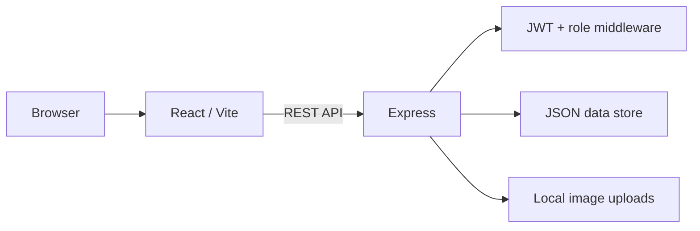

# LocalExpress Marketplace

A full-stack **multi-vendor local e-commerce marketplace** built with React, Vite, Node.js, and Express. LocalExpress demonstrates end-to-end buyer, seller, and administrator workflows in a repository that can be run locally without provisioning an external database.

> **Portfolio status:** functional demo / learning project. The repository is intentionally easy to run locally; production deployment would require the upgrades documented below.

## Highlights

- Role-based buyer, seller, and administrator experiences
- JWT authentication with bcrypt password hashing
- Product catalog with search and category filters
- Seller product creation, editing, stock management, and image upload
- Cart, checkout, order creation, and buyer order history
- Transaction-style stock updates during checkout
- Seller order management and marketplace administration
- Responsive React interface
- Local JSON persistence with automatic seed data
- Health endpoint, environment validation, repository checks, and GitHub Actions CI
- Detailed API, database, installation, testing, deployment, SRS, and architecture documentation

## Tech stack

| Layer | Technology |
|---|---|
| Frontend | React 18, React Router, Vite, Lucide React, CSS |
| Backend | Node.js, Express.js |
| Authentication | JWT, bcryptjs |
| Uploads | Multer |
| Persistence | Local JSON data store |
| Tooling | npm, GitHub Actions |

## Architecture



See [`docs/ARCHITECTURE.md`](docs/ARCHITECTURE.md) for more detail.

## User roles

### Buyer
- Register and sign in
- Browse/search/filter products
- View product details
- Add items to cart
- Checkout
- Review order history and status

### Seller
- Register a seller account and shop
- Create and update products
- Manage inventory
- Upload product images
- View orders containing their products
- Update order progress

### Administrator
- View marketplace statistics
- Review users, shops, and orders
- Enable/disable non-admin users
- Update shop status

## Quick start

### Requirements

- Node.js 20+
- npm

### 1. Clone and install

```bash
git clone <your-repository-url>
cd localexpress-marketplace
npm run install:all
```

### 2. Configure environment variables

Copy the example files:

**Windows PowerShell**

```powershell
Copy-Item backend/.env.example backend/.env
Copy-Item frontend/.env.example frontend/.env
```

**macOS/Linux**

```bash
cp backend/.env.example backend/.env
cp frontend/.env.example frontend/.env
```

Then replace `JWT_SECRET` in `backend/.env` with a private random value. For example, Node.js can generate one locally:

```bash
node -e "console.log(require('crypto').randomBytes(32).toString('hex'))"
```

### 3. Start the application

```bash
npm run dev
```

- Frontend: `http://localhost:5173`
- API: `http://localhost:5000`
- Health check: `http://localhost:5000/health`

## Demo accounts

The local database is seeded automatically on first backend start.

| Role | Email | Password |
|---|---|---|
| Seller | `seller@localexpress.com` | `seller123` |
| Buyer | `buyer@localexpress.com` | `buyer123` |

These credentials are **demo-only** and must not be reused in a deployed environment.

## Repository structure

```text
localexpress-marketplace/
├── .github/                  # CI and GitHub templates
├── backend/
│   └── src/
│       ├── database/         # Generated local JSON data (ignored by Git)
│       ├── middleware/       # Authentication and authorization
│       ├── routes/           # REST API routes
│       ├── uploads/          # Local uploaded images
│       ├── config.js         # Environment configuration
│       ├── db.js             # File-backed data layer
│       └── server.js
├── frontend/
│   └── src/
│       ├── components/
│       ├── context/
│       ├── pages/
│       ├── api.js
│       └── App.jsx
├── docs/
├── planning/
├── scripts/
├── CONTRIBUTING.md
├── SECURITY.md
└── README.md
```

## Useful commands

```bash
npm run install:all   # install backend and frontend dependencies
npm run dev           # run both applications
npm run check         # repository and backend syntax checks
npm run build         # production-build the frontend
npm run clean         # remove local generated project artifacts
```

## API overview

| Area | Example endpoints |
|---|---|
| Authentication | `POST /api/auth/register`, `POST /api/auth/login`, `GET /api/auth/me` |
| Products | `GET /api/products`, `GET /api/products/:id`, `POST /api/products` |
| Orders | `POST /api/orders`, `GET /api/orders/my-orders`, `PUT /api/orders/:id/status` |
| Seller | `GET /api/seller/dashboard` |
| Admin | `GET /api/admin/dashboard`, `PUT /api/admin/users/:id/toggle` |

Full request examples are available in [`docs/API_DOCUMENTATION.md`](docs/API_DOCUMENTATION.md).

## Security and design decisions

- Passwords are hashed with bcrypt before storage.
- JWT secrets are read from environment variables; there is no hard-coded fallback secret.
- Backend middleware enforces role authorization.
- Seller ownership is checked before product modification.
- Order totals are calculated using server-side product prices.
- Product stock is checked and reduced as part of the order operation.
- Uploaded images are size-limited and restricted to common image MIME types.
- Generated database content, local uploads, and `.env` files are ignored by Git.

This is still a portfolio/demo system. See [`SECURITY.md`](SECURITY.md) for production limitations.

## Documentation

- [Architecture](docs/ARCHITECTURE.md)
- [Installation guide](docs/INSTALLATION_GUIDE.md)
- [API documentation](docs/API_DOCUMENTATION.md)
- [Database schema](docs/DATABASE_SCHEMA.md)
- [Testing guide](docs/TESTING_GUIDE.md)
- [User manual](docs/USER_MANUAL.md)
- [Deployment notes](docs/DEPLOYMENT_NOTES.md)
- [Software requirements specification](docs/SOFTWARE_REQUIREMENTS_SPECIFICATION.md)
- [Project documentation](docs/PROJECT_DOCUMENTATION.md)
- [GitHub publication checklist](docs/GITHUB_RELEASE_CHECKLIST.md)
- [Suggested GitHub repository/profile copy](docs/GITHUB_PROFILE_COPY.md)
- [Changelog](CHANGELOG.md)

## Production roadmap

The highest-value next steps are:

1. Replace JSON persistence with PostgreSQL and migrations.
2. Add schema-based validation and API rate limiting.
3. Move images to Cloudinary or S3-compatible object storage.
4. Add Paystack/Flutterwave payment processing.
5. Add account verification, password recovery, and audit logging.
6. Add automated API tests and end-to-end browser tests.
7. Deploy frontend and API and add screenshots/demo media to this README.

## Author

**Lawal Nasir Lawal**  
Data Science • Artificial Intelligence • Machine Learning • Software Development  
GitHub: [@Shaheedie](https://github.com/Shaheedie)

## Project note

LocalExpress was built as a practical full-stack marketplace project and portfolio demonstration. It is not affiliated with AliExpress or any other marketplace platform.
