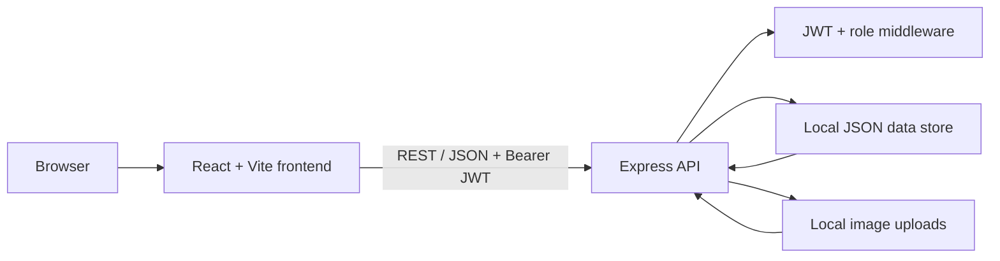

# Architecture

LocalExpress uses a simple client-server architecture optimized for easy local evaluation.

## Frontend

The React frontend provides public product browsing plus authenticated buyer, seller, and administrator workflows. `AuthContext` manages the signed-in user and token, while `CartContext` manages shopping-cart state.

## Backend

The Express API is organized by domain:

- `auth` — registration, login, current-user lookup;
- `products` — catalog, seller product management, image upload;
- `orders` — checkout, buyer history, seller order workflows;
- `seller` — seller dashboard data;
- `admin` — administrative statistics and account/shop controls.

Authentication is enforced by reusable JWT and role middleware.

## Persistence

For portability, the repository includes a file-backed JSON data layer that emulates the small set of queries needed by the application. The data file is generated automatically and is intentionally ignored by Git.

This design is suitable for portfolio demos and local development. A production implementation should replace it with PostgreSQL or another transactional database and use object storage for media.

## Trust boundaries

The frontend is not trusted for authorization. Backend middleware enforces authentication and roles. Product ownership is checked server-side before updates or removal, and order totals are calculated from server-side product prices rather than client-submitted totals.
