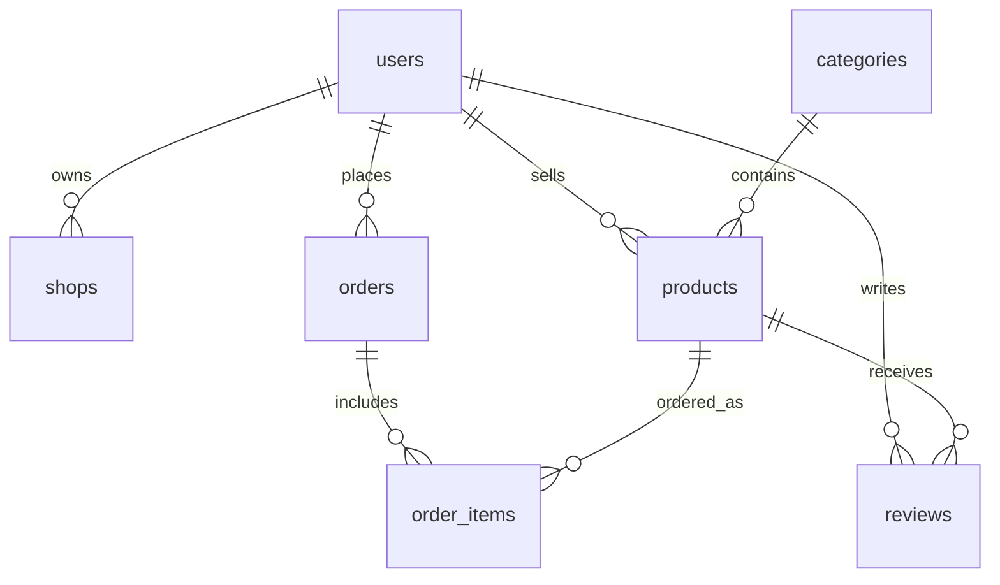

# Database Schema

The project uses a simple JSON file database for easy local setup. The data file is automatically created at:

```text
backend/src/database/localexpress-data.json
```

## Main Tables

### users

Stores all buyer, seller, and admin accounts.

| Field | Description |
|---|---|
| id | Unique user ID |
| name | User full name |
| email | Unique email address |
| password_hash | Hashed password |
| role | buyer, seller, or admin |
| phone | User phone number |
| address | User address |
| town | User town |
| is_active | Account status |
| created_at | Date created |

### shops

Stores seller shop details.

| Field | Description |
|---|---|
| id | Unique shop ID |
| user_id | Seller user ID |
| shop_name | Name of shop |
| description | Shop description |
| town | Shop town |
| status | pending, approved, or blocked |
| created_at | Date created |

### categories

Stores product categories.

| Field | Description |
|---|---|
| id | Unique category ID |
| name | Category name |
| slug | URL-friendly category name |

### products

Stores products uploaded by sellers.

| Field | Description |
|---|---|
| id | Unique product ID |
| seller_id | Seller user ID |
| category_id | Category ID |
| name | Product name |
| description | Product description |
| price | Product price |
| stock | Available quantity |
| image_url | Product image |
| is_active | Product visibility |
| created_at | Date created |

### orders

Stores order summary information.

| Field | Description |
|---|---|
| id | Unique order ID |
| buyer_id | Buyer user ID |
| total_amount | Total order amount |
| status | Order status |
| payment_method | Cash on delivery or bank transfer |
| payment_status | Payment status |
| delivery_type | Delivery or pickup |
| delivery_address | Delivery address |
| phone | Buyer phone number |
| notes | Buyer notes |
| created_at | Date created |

### order_items

Stores products inside each order.

| Field | Description |
|---|---|
| id | Unique order item ID |
| order_id | Order ID |
| product_id | Product ID |
| seller_id | Seller ID |
| quantity | Quantity ordered |
| unit_price | Price per item at purchase time |

### reviews

Stores product reviews. The table is included for future extension.

| Field | Description |
|---|---|
| id | Unique review ID |
| product_id | Product ID |
| buyer_id | Buyer ID |
| rating | Rating from 1 to 5 |
| comment | Review comment |
| created_at | Date created |

## Entity Relationship Summary


